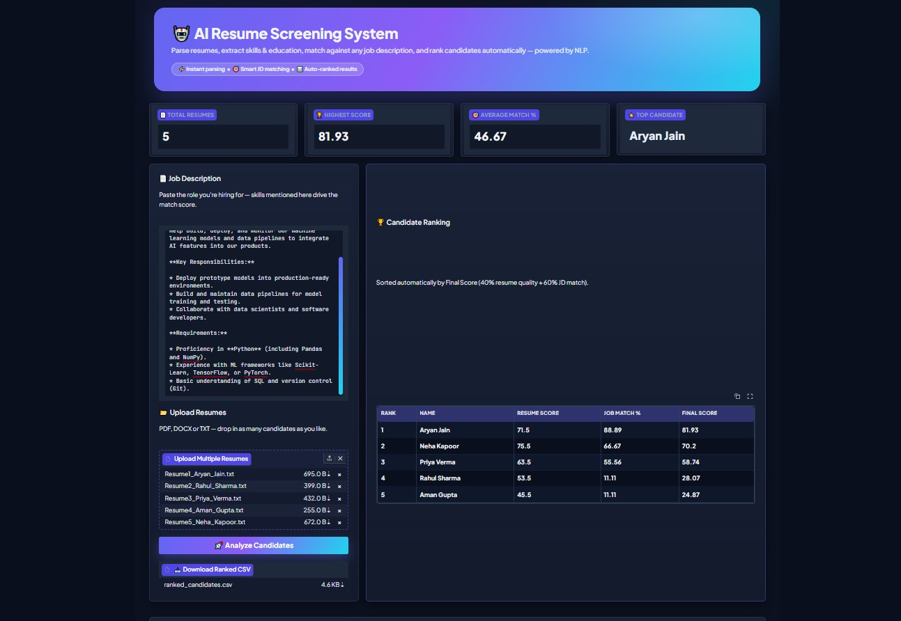
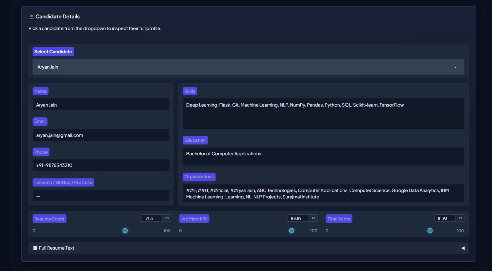

# 📄 AI Resume Parser, Job Matching & Candidate Ranking System

> An AI-powered recruitment assistant that parses resumes, extracts candidate information using BERT-based Named Entity Recognition (NER), matches resumes with job descriptions using TF-IDF, ranks applicants, and exports the ranked results as a CSV file.

---

## 🚀 Overview

Recruiters often spend significant time manually reviewing resumes to identify suitable candidates. This project automates that process by extracting structured information from resumes, evaluating candidate profiles, comparing resumes against a job description, ranking applicants based on their suitability, and generating a downloadable CSV report.

The application supports **PDF**, **DOCX**, and **TXT** resumes and provides an intuitive **Gradio** interface for seamless candidate analysis.

---

## ✨ Features

- 📂 Supports **PDF**, **DOCX**, and **TXT** resume formats
- 📄 Parse multiple resumes simultaneously
- 🤖 Named Entity Recognition (NER) using **Hugging Face BERT (`dslim/bert-base-NER`)**
- 👤 Automatically extracts:
  - Name
  - Email Address
  - Phone Number
  - Skills
  - Education
  - Organizations
- 📊 Resume Quality Scoring
- 🎯 Job Description Matching using **TF-IDF**
- 🏆 Automatic Candidate Ranking
- 📈 Resume Score, Job Match Score & Final Score Calculation
- 📋 Interactive Candidate Details Dashboard
- 📥 Export ranked candidate data as a **CSV report**
- 🎨 Modern Gradio-based user interface

---

## 🛠 Tech Stack

| Category | Technologies |
|-----------|--------------|
| Programming Language | Python 3.11 |
| NLP | Hugging Face Transformers, BERT (`dslim/bert-base-NER`), TF-IDF, Regular Expressions |
| Machine Learning | Scikit-learn |
| Data Processing | Pandas, NumPy |
| UI Framework | Gradio |

---

## 📂 Project Structure

```text
AI-Resume-Parser-and-Job-Matcher/
│
├── app.py
├── parser.py
├── colleges.txt
├── degrees.txt
├── skills.txt
├── requirements.txt
├── README.md
├── .gitignore
│
└── screenshots/
    ├── image1.jpg
    └── image2.jpg
```

---

# 📸 Application Dashboard

The dashboard enables recruiters to upload multiple resumes, enter a job description, analyze candidates, rank applicants automatically, and export the ranked results as a CSV file.



---

# 👤 Candidate Details

Each candidate profile includes extracted personal information, education, skills, organizations, resume score, job match percentage, and final ranking score.



---

# ⚙️ Workflow

```text
Upload Resumes
        │
        ▼
Resume Text Extraction
        │
        ▼
Named Entity Recognition (BERT)
        │
        ▼
Information Extraction
        │
        ▼
Resume Quality Scoring
        │
        ▼
TF-IDF Job Matching
        │
        ▼
Final Score Calculation
        │
        ▼
Candidate Ranking
        │
        ▼
CSV Report Generation
```

---

## 🚀 Installation

Clone the repository

```bash
git clone https://github.com/aryan7189jain/AI-Resume-Parser-and-Job-Matcher.git
```

Navigate to the project directory

```bash
cd AI-Resume-Parser-and-Job-Matcher
```

Install dependencies

```bash
pip install -r requirements.txt
```

Run the application

```bash
python app.py
```

---

## 💻 Usage

1. Launch the Gradio application.
2. Upload one or more resumes (**PDF**, **DOCX**, or **TXT**).
3. Enter the target job description.
4. Click **Analyze Candidates**.
5. Review ranked candidates.
6. Open detailed candidate profiles.
7. Download the ranked results as a CSV report.

---

## 📊 Output

The system generates:

- Candidate Information
- Resume Score
- Job Match Score
- Final Candidate Score
- Ranked Candidate List
- Detailed Candidate Profile
- Downloadable CSV Report

---

## 🔮 Future Improvements

- Improve semantic job matching using transformer-based embedding models.
- Add recruiter analytics dashboard.
- Support additional resume formats.
- Interview recommendation system.
- Deploy as a cloud-hosted web application.

---

## 👨‍💻 Author

**Aryan Jain**

📧 Email: aryan7189jain@gmail.com

💼 LinkedIn: https://www.linkedin.com/in/aryan-jain-211037327

💻 GitHub: https://github.com/aryan7189jain
